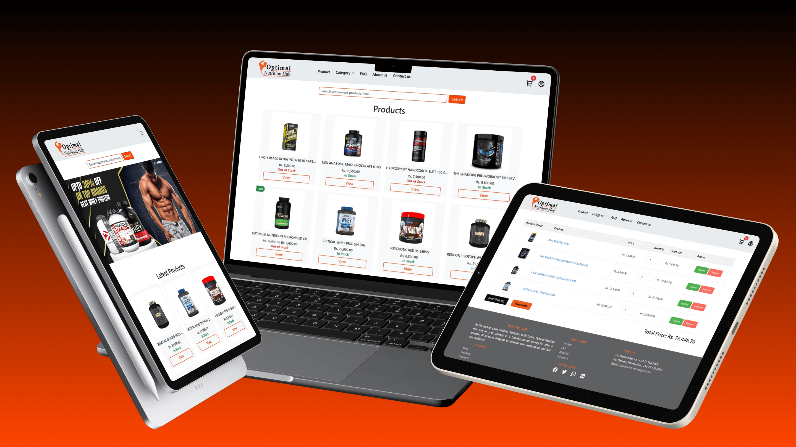

# 💪 Optimal Nutrition Hub (Group Project)

A **full stack web application** developed to streamline the supplement ordering process with **category & item management**, **cart operations**, **order handling**, and **user management**. The system Secured application with **session handling**, **role-based access control**, and **restricted access**.

---

## 🖼️ Preview


---

## 🛠️ Tech Stack
<table>
  <tr>
    <td><h4>Frontend:</h4></td>
    <td align="center">
        <code></code><br/>
        <sup>HTML</sup>
    </td>
    <td align="center">
        <code></code><br/>
        <sup>CSS</sup>
    </td>
    <td align="center">
        <code></code><br/>
        <sup>JavaScript</sup>
    </td>
    <td align="center">
        <code></code><br/>
        <sup>Bootstrap</sup>
    </td>
  </tr>
</table>

<table>
  <tr>
    <td><h4>Backend & Database:</h4></td>
    <td align="center">
        <code></code><br/>
        <sup>PHP</sup>
    </td>
    <td align="center">
        <code></code><br/>
        <sup>MySQL</sup>
    </td>
  </tr>
</table>

---

## 🚀 Getting Started
### Prerequisites
- Install [XAMPP](https://www.apachefriends.org/) (Apache + MySQL)  
- Install [Git](https://git-scm.com/) 

### Installation  
1. Clone the repository:  
    ```
    git clone https://github.com/randima-edussuriya/optimal-nutrition-hub.git
    ```

2. Move the project into the **htdocs** folder of your XAMPP installation:
     ```
     C:/xampp/htdocs/optimal-nutrition-hub
     ```
    
  3. Import the database:
      - Open phpMyAdmin at http://localhost/phpmyadmin
      - Create a new database (optimal_nutrition_hub)
      - Import the provided SQL file (in /database folder)

4. Run the project in your browser:
    - Client side - http://localhost/optimal-nutrition-hub
    - Admin side - http://localhost/optimal-nutrition-hub/admin

---

## 📜 License
This project was developed for academic purposes.